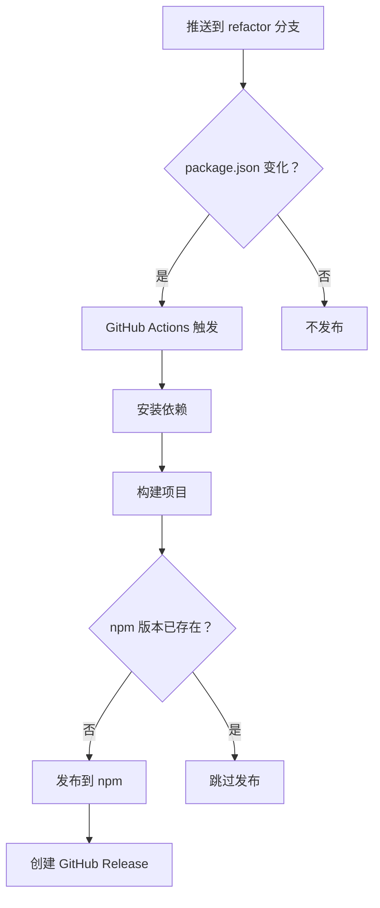

# 自动发布指南

## 🚀 自动发布流程

现在当你推送到 **main** 分支且 `package.json` 中的 `version` 发生变化时，GitHub Actions 会自动：

1. ✅ 构建项目
2. ✅ 发布到 npmjs.com
3. ✅ 创建 GitHub Release

## 📝 使用方法

### 方法 1: 本地修改版本号后推送

```bash
# 1. 修改 package.json 中的 version
# 例如：1.0.0 -> 1.0.1

# 2. 提交并推送
git add package.json
git commit -m "chore(release): v1.0.1"
git push origin main

# 3. 等待 GitHub Actions 自动发布
```

### 方法 2: 使用发布脚本（推荐）

```bash
# 自动升级 patch 版本 (1.0.0 -> 1.0.1)
npm run release

# 或指定版本类型
npm run release:patch    # 1.0.0 -> 1.0.1
npm run release:minor    # 1.0.0 -> 1.1.0
npm run release:major    # 1.0.0 -> 2.0.0

# 或指定具体版本
npm run release 1.0.2
```

### 方法 3: 创建 GitHub Release

```bash
# 创建并推送 tag
git tag v1.0.0
git push origin v1.0.0

# 然后在 GitHub 创建 Release
# https://github.com/MY-Final/n8n-nodes-onebot-api/releases/new
```

## ⚙️ 工作流程



## 📋 检查清单

确保已配置：

- ✅ **npm_token** Secret:
  - Settings → Secrets and variables → Actions
  - Name: `npm_token`
  - Value: 你的 npm access token

- ✅ **包名未被占用**:
  - 检查：https://www.npmjs.com/package/n8n-nodes-onebot-plus

## 🔍 查看发布状态

- **GitHub Actions**: https://github.com/MY-Final/n8n-nodes-onebot-api/actions/workflows/npm-publish.yml
- **npm 包页面**: https://www.npmjs.com/package/n8n-nodes-onebot-plus
- **Releases**: https://github.com/MY-Final/n8n-nodes-onebot-api/releases

## ⚠️ 注意事项

1. **版本号必须唯一** - npm 不允许覆盖已发布的版本
2. **推送到 refactor 分支** - 只有 refactor 分支会触发自动发布
3. **需要 npm_token** - 确保 Secret 已正确配置
4. **public access** - 包会发布为 public（需要 npm 账号支持）

## 🎯 快速开始

```bash
# 第一次发布
npm run release

# 等待 GitHub Actions 完成
# 访问 npm 查看结果
```

就这么简单！🎉
